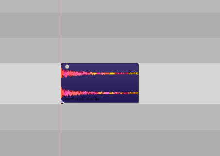
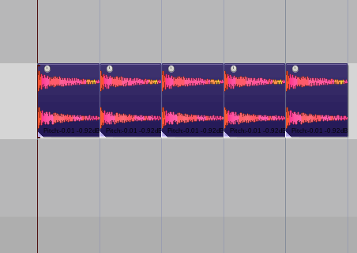
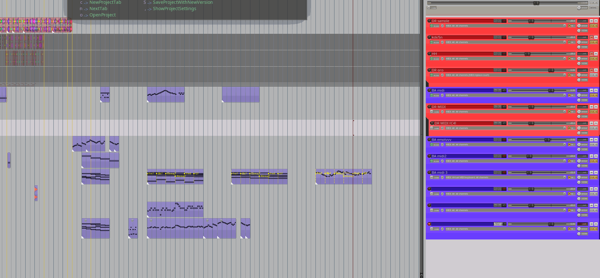

Scripts for the Reaper DAW.

[Scripts list](#scripts-list) 

### Scripts list
#### Realearn - Midi Fighter Twister utilities

 
MFT map selected fx in visible fx chain
 

`$REAPERPATH/Scripts/perken/realearn/lua_mapper/MFT_map_selected_fx_in_visible_fx_chain.lua`
##### HOW TO USE: 
  - have a realearn instance on the current track with the Midi fighter's preset loaded in the controller compartment.
  - open the FXchain
  - select some FX in current chain, 
  - focus the arrange view, 
  - call the script
  - focus realearn
  - click button «import from clipboard» 
##### What it does: 
  Each parameter of the selected FX gets assigned a knob on the Midi Fighter Twister.
  Paging is done with side-buttons. 
  Only basic jsfx seem to work correctly atm.

 
MFT Synth map
 

`$REAPERPATH/Scripts/perken/realearn/synth_map/synth_map_midiFighter.lua`
##### HOW TO USE: 
- have a realearn instance with the Midi fighter's preset loaded in the controller compartment.
- call the script
- focus the realearn window,
- click «import from clipboard»
- NB LINUX USERS: realearn struggles to read from clipboard directly, you might have to paste into a text editor first, and then copy from there.
##### What it does: 
See full description at [the forum post](https://forum.cockos.com/showpost.php?p=2731732&postcount=3803)

#### Drums utilities

 
Flam: create a flam for selected items
 

`$REAPERPATH/Scripts/perken/main/drum_actions/flam.lua`
##### HOW TO USE: 
- in arrange view, select an item and call the action
##### What it does: 
- creates a flam right before the selected items, at a lower volume
- works with midi, too

 
5 stroke: create a drum 4 stroke-flush on the selected item
 

`$REAPERPATH/Scripts/perken/main/drum_actions/5stroke.lua`
##### HOW TO USE: 
- in arrange view, select an item and call the action
##### What it does: 
- creates a 4stroke right before the selected items, at a lower volume
- works with midi, too

 
3 stroke: create a drum 2 stroke-flush on the selected item
 

`$REAPERPATH/Scripts/perken/main/drum_actions/3stroke.lua`
##### HOW TO USE: 
- in arrange view, select an item and call the action
##### What it does: 
- creates a 2stroke right before the selected items, at a lower volume
- works with midi, too

 
Crescendo selected items's volumes
 

`$REAPERPATH/Scripts/perken/main/drum_actions/crescendo_items_volumes.lua`
##### HOW TO USE: 
- in arrange view, select some items (preferably next to each other) and call the action
##### What it does: 
- Tweaks the volume of the selected items to create a crescendo

 
Decrescendo selected items's volumes
 

`$REAPERPATH/Scripts/perken/main/drum_actions/decrescendo_items_volumes.lua`
##### HOW TO USE: 
- in arrange view, select some items (preferably next to each other) and call the action
##### What it does: 
- Tweaks the volume of the selected items to create a decrescendo

#### Routing utilities

 
Auto-route tracks: Create busses with all common prefixes found in "Busses" list, route tracks to their corresponding colours.
 

`$REAPERPATH/Scripts/perken/main/Routing/CreateBusses.lua`
##### HOW TO USE: 
- call action from arrange view
##### What it does: 
- Creates busses with all common prefixes found in "Busses" list.
- Then routes all tracks to their corresponding busses, using matching colors.
- Removes any unused busses.
- Common Prefixes are:
- "BA", "BGV", "BR", "Choir", "DR", "FX", "FullMix", "GTR", "Keys", "LD", "PD", "PL", "PNO", "PRC ", "STR", "TXT", "WD",

 
Route tracks to busses with same colours
 

`$REAPERPATH/Scripts/perken/main/Routing/routeColoursToBusses.lua`
##### HOW TO USE: 
- call action from arrange view
##### What it does: 
- assuming all the needed busses are already in the session,
- route all tracks with "bus" in name to receive from other tracks with same color

#### Arranging utilities

 
Paste rhythm to pitches
 
Mod from Pandabot's excellent [Paste Rhythm](https://forum.cockos.com/showthread.php?t=214231). Difference is, my version doesn't require a special copy action

`$REAPERPATH/Scripts/perken/main/pasteRhythmToPitches.lua`
##### HOW TO USE: 
- copy an item in arrange view
- select another item, call the action
##### What it does: 
- pastes the copied item's rhythm to current item's pitches

