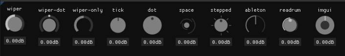

### reaImgui-lua-knobs
A port of [imgui-rs-knobs](https://github.com/DGriffin91/imgui-rs-knobs) to lua for [ReaImGui](https://forum.cockos.com/showthread.php?t=250419), with a few extra goodies.



### Usage: 

```lua
local value = 0.0
local default_value= 0.0
local min = -6.0
local max = 6.0
local is_controllable = true
local format = "%.2fdB"

value = Knob.new(self.ctx,
    "knob_id",
    "knob_label",
    value,
    min,
    max,
    default_value,
    width,
    is_controllable,
    format
):draw(
    Knob.KnobVariant.wiper_knob,
    self.colors.base,
    self.colors.highlight,
    self.colors.lowlight
)
```
